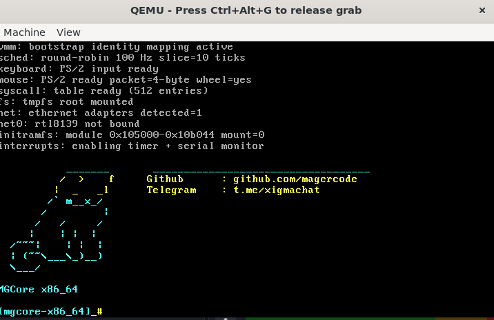

# MGCORE



MGCORE sekarang dibentuk sebagai fondasi kernel `x86_64` freestanding dengan boot GRUB Multiboot2, subsistem kernel modular, syscall ABI mirip Linux untuk subset awal, dan jalur build userspace ELF statis.

## Struktur inti

- `boot/` : header Multiboot2, transisi long mode, linker script, dan `grub.cfg`
- `src/kernel/` : console, interrupt/timer, PMM/VMM, scheduler/task, VFS/tmpfs, ELF, signal, syscall arch
- `src/syscall/` : nomor syscall Linux-like, dispatch table, dan implementasi syscall
- `include/mgcore/` : header publik kernel dan ABI
- `lib/libc/` : libc minimal untuk program userspace statis
- `lib/crt/` : entry runtime `_start`
- `userspace/` : `init`, `shell`, test program C, dan contoh script Python
- `scripts/` : pembuat initramfs dan helper run
- `docs/syscalls.md` : daftar syscall yang sudah di-scaffold

## Navigasi dokumentasi

- `docs/syscall.md` : penjelasan lengkap syscall (apa, kenapa, cara kerja, analogi)
- `docs/syscalls.md` : daftar status syscall MGCORE (implemented/scaffold/placeholder)

## Toolchain

Baseline yang diasumsikan:

- `clang`
- `ld.lld`
- `nasm`
- `grub-mkrescue`
- `qemu-system-x86_64`
- `python3`

MSYS2 `CLANG64` yang praktis:

```powershell
pacman -S --needed mingw-w64-clang-x86_64-clang mingw-w64-clang-x86_64-lld mingw-w64-clang-x86_64-cmake mingw-w64-clang-x86_64-ninja mingw-w64-clang-x86_64-nasm mingw-w64-clang-x86_64-qemu mingw-w64-clang-x86_64-grub mingw-w64-clang-x86_64-xorriso
```

Jika `nasm` belum tersedia, konfigurasi source-only tetap bisa dijalankan dengan:

```powershell
cmake -S . -B build-lite -G Ninja -DMGCORE_REQUIRE_NASM=OFF
```

## Build penuh

Di Windows/MSYS2, siapkan Limine binary release dulu:

```powershell
./scripts/setup-limine.ps1
```

Atau dari shell MSYS2:

```sh
./scripts/setup-limine.sh
```

```powershell
cmake -S . -B build -G Ninja
cmake --build build
```

Output utama yang diharapkan:

- `build/kernel.elf`
- `build/initramfs.cpio`
- `build/mgcore.iso`

Catatan bootloader:

- Windows/MSYS2 default ke `Limine`
- host non-Windows default ke `GRUB`
- override manual bisa pakai `-DMGCORE_BOOTLOADER=LIMINE` atau `-DMGCORE_BOOTLOADER=GRUB`

## Run

Shell:

```sh
./run.sh build gui
```

PowerShell:

```powershell
./scripts/run.ps1 -BuildDir build
```

Untuk mode terminal/serial:

```powershell
./scripts/run.ps1 -BuildDir build -Mode stdio
```

Mode input:

- `gui` memakai jendela QEMU dengan input keyboard PS/2 untuk CLI
- `stdio` tetap memakai serial `-serial stdio`

## Perintah Shell Tambahan

- `mgctl status` : status ringkas sistem koneksi
- `mgctl net tools` : daftar driver koneksi asli yang jadi target integrasi (`e1000/e1000e`, `rtl8139`, `virtio-net`, `ne2k-pci`)
- `mgctl net adapters` : daftar ethernet controller hasil deteksi PCI
- `mgctl net scan` / `mgctl net nearby` : scan gateway ARP + tampilkan status stack jaringan nyata
- `mgctl net connect <net0|default|up>` : bring-up koneksi `net0` (resolve gateway)
- `mgctl power safe status|reboot|shutdown` : policy safe boot saat panic/memory leak
- `nearby` : shortcut scan + list koneksi terdekat
- `connect <net0|default|up>` : shortcut bring-up koneksi `net0`
- `ping <ipv4> [count]` : ICMP ping nyata (contoh `ping 8.8.8.8 4`)
- `shutdown` : halt mesin
- `reboot` : reboot mesin

## Status implementasi

Yang sudah masuk ke repo:

- boot path `32-bit -> long mode`
- console serial + VGA text
- IDT, PIC remap, PIT 100 Hz, interrupt stubs
- PMM bitmap sederhana
- VMM/address-space scaffold
- task table + scheduler metadata round-robin
- syscall ABI `x86_64` dengan 50+ nomor syscall yang dideklarasikan
- VFS/tmpfs + mount initramfs `cpio newc`
- ELF64 parser/probe
- libc/crt minimal untuk binary userspace statis

Yang masih berupa scaffold atau placeholder:

- context switch penuh dan eksekusi ring-3 nyata
- `fork` copy-on-write sesungguhnya
- `execve` yang benar-benar mengganti image proses
- signal delivery lengkap
- driver mouse nyata
- port MicroPython/CPython

Repo ini sekarang siap dilanjutkan ke fase bring-up berikutnya tanpa perlu merombak ulang struktur utama.
